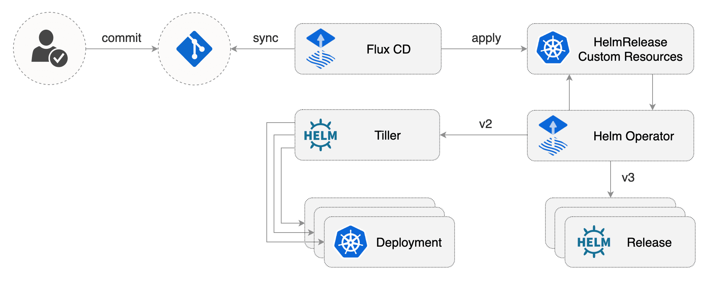

# Helm Operator

The Helm operator is a [Kubernetes operator](https://kubernetes.io/docs/concepts/extend-kubernetes/operator/),
allowing one to declaratively manage Helm chart releases. Combined with
[Flux](https://github.com/fluxcd/flux) this can be utilized to automate
releases in a GitOps manner, but the usage of Flux is not a strict
requirement.

The desired state of a Helm release is described through a Kubernetes
Custom Resource named `HelmRelease`. Based on the creation, mutation or
removal of a `HelmRelease` resource in the cluster, Helm actions are
performed by the operator.

## Helm Operator features

* Declarative install, upgrade, and delete of Helm releases
* Pulls chart from _any_ chart source;
  * Public or private Helm repositories over HTTP/S
  * Public or private Git repositories over HTTPS or SSH
  * Any other public or private chart source using one of the available
    [Helm downloader plugins](https://helm.sh/docs/topics/plugins/#downloader-plugins)
* Allows Helm values to be specified;
  * In-line in the `HelmRelease` resource
  * In (external) sources, e.g. `ConfigMap` and `Secret` resources,
    or a (local) URL
* Automated purging on release install failures
* Automated (optional) rollback on upgrade failures
* Automated image upgrades [using Flux](https://docs.fluxcd.io/en/latest/references/helm-operator-integration.html)
* Automated (configurable) chart dependency updates for Helm charts
  from Git sources on install or upgrade
* Detection and recovery from Helm storage mutations
  (e.g. a manual Helm release that was made but conflicts with the
  declared configuration for the release)
* Parallel and scalable processing of different `HelmRelease` resources
  using workers
* Supports both Helm 2 and 3

## Get started with the Helm Operator

Get started [installing the Helm operator](/chart/helm-operator/README.md)
or just [browse through the documentation](https://docs.fluxcd.io/projects/helm-operator/en/latest/).

### Integrations

As Flux Helm Operator is Open Source, integrations are very straight-forward. Here are
a few popular ones you might want to check out:

- [Progressive Delivery workshop (Helm v3 alpha)](https://helm.workshop.flagger.dev/)
- [Managing Helm releases the GitOps way](https://github.com/fluxcd/helm-operator-get-started)
- [GitOps for Istio Canary deployments](https://github.com/stefanprodan/gitops-istio)

## Community & Developer information

We welcome all kinds of contributions to Helm Operator, be it code, issues you found,
documentation, external tools, help and support or anything else really.

The FluxCD projects adheres to the [CNCF Code of
Conduct](https://github.com/cncf/foundation/blob/master/code-of-conduct.md).

Instances of abusive, harassing, or otherwise unacceptable behavior
may be reported by contacting a _Flux_ project maintainer, or the CNCF
mediator, Mishi Choudhary <mishi@linux.com>.

To familiarise yourself with the project and how things work, you might
be interested in the following:

- [Our contributions guidelines](CONTRIBUTING.md)
- [Build documentation](https://docs.fluxcd.io/en/latest/contributing/building.html)
- [Release documentation](/internal_docs/releasing.md)

## Getting Help

If you have any questions about Helm Operator and continuous delivery:

- Read [the Helm Operator docs](https://docs.fluxcd.io/projects/helm-operator/).
- Invite yourself to the <a href="https://slack.cncf.io" target="_blank">CNCF community</a>
  slack and ask a question on the [#flux](https://cloud-native.slack.com/messages/flux/)
  channel.
- To be part of the conversation about Helm Operator's development, join the
  [flux-dev mailing list](https://lists.cncf.io/g/cncf-flux-dev).
- [File an issue.](https://github.com/fluxcd/helm-operator/issues/new)

Your feedback is always welcome!
